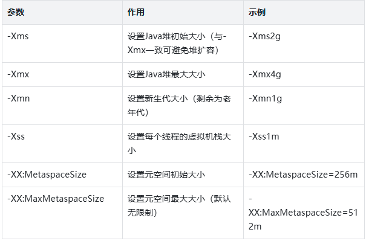

# JVM 内存区域

## 1. JVM 内存区域的核心划分

根据《Java 虚拟机规范》（Java SE 8），JVM 在执行 Java 程序时，会将其管理的内存划分为若干个不同的数据区域。这些区域有明确的用途，以及不同的创建和销毁时间。

整体可以分为两大类：

- **线程私有区域**：与线程生命周期绑定。
- **线程共享区域**：由所有线程共享。

## 2. 线程私有区域：每个线程的“专属空间”

线程私有区域包括程序计数器、Java 虚拟机栈和本地方法栈。它们的生命周期与线程强绑定，为线程执行提供基础支撑。

### 2.1 程序计数器：线程执行的“导航仪”

程序计数器（Program Counter Register）是一块极小的内存空间，可以看作当前线程所执行字节码的行号指示器。

- **核心作用**：记录当前线程正在执行的 Java 方法的字节码指令地址。如果执行的是 `native` 方法，则计数器值为 `undefined`。线程切换后，可以通过程序计数器快速恢复到之前的执行位置。
- **特点**：唯一不会抛出 `OutOfMemoryError`（OOM）的内存区域。其内存大小与处理器架构相关，属于线程私有的微型导航器。

### 2.2 Java 虚拟机栈：方法执行的“状态容器”

Java 虚拟机栈（Java Virtual Machine Stacks）是线程私有的。每个方法执行时都会创建一个栈帧（Stack Frame），用于存储局部变量表、操作数栈、动态链接和方法出口等信息。

方法从调用到执行完成的过程，对应栈帧在虚拟机栈中入栈到出栈的过程。

#### 栈帧的核心组成

- **局部变量表**：存储方法参数和方法内部定义的局部变量，包括基本数据类型（如 `boolean`、`byte`）、对象引用（指向堆中对象的地址）和 `returnAddress` 类型。局部变量表的大小在编译期确定，运行时不会改变。
- **操作数栈**：存放方法执行过程中的中间运算结果。例如执行 `int a = 1 + 2;` 时，会先将 `1` 和 `2` 压入操作数栈，再执行加法指令，将结果弹出并重新压栈。
- **动态链接**：将栈帧中的符号引用转换为直接引用，确保方法调用的正确性。

#### 代码示例：栈帧的入栈与出栈

```java
public class StackDemo {
    public static void main(String[] args) {
        int a = 1;
        int b = 2;
        int result = add(a, b);
        System.out.println(result);
    }

    public static int add(int x, int y) {
        int sum = x + y;
        return sum;
    }
}
```

上述代码的栈帧运作过程：

1. `main` 方法执行，创建 `main` 栈帧并入栈，局部变量表存储 `a`、`b`、`result` 等变量。
2. 调用 `add` 方法，创建 `add` 栈帧并入栈，局部变量表存储 `x`、`y`、`sum`。
3. `add` 方法执行完成，`sum` 作为返回值压入 `main` 栈帧的操作数栈，`add` 栈帧出栈。
4. `main` 方法获取返回值并赋值给 `result`。执行完成后，`main` 栈帧出栈，线程结束。

### 2.3 本地方法栈：Native 方法的“执行空间”

本地方法栈（Native Method Stack）与 Java 虚拟机栈的作用类似，区别在于：

- Java 虚拟机栈为 Java 方法服务。
- 本地方法栈为虚拟机使用的 `native` 方法服务，例如 Java 调用由 C/C++ 编写的方法。

本地方法栈的异常类型与 Java 虚拟机栈一致，同样可能抛出 `StackOverflowError` 和 `OutOfMemoryError`。在 HotSpot 虚拟机中，本地方法栈与 Java 虚拟机栈合二为一，不再单独区分。

## 3. 线程共享区域：所有线程的“公共资源池”

线程共享区域包括 Java 堆和方法区，是 JVM 内存管理的重点和难点，也是内存溢出问题的主要发生区域。

### 3.1 Java 堆：对象的“诞生地”

Java 堆（Java Heap）是 JVM 管理的内存中最大的一块，在虚拟机启动时创建，并由所有线程共享。几乎所有 Java 对象实例和数组都在这里分配内存。

随着 JIT 编译器的发展，部分对象可能会通过“栈上分配”优化在栈上分配。

#### 堆的内存划分（GC 视角）

为了便于垃圾回收（GC），Java 堆通常会被划分为不同区域（以 HotSpot 虚拟机为例）：

- **新生代（Young Generation）**：存储刚创建的对象，GC 频率高、回收速度快。分为 Eden 区和两个 Survivor 区（From Survivor、To Survivor），默认比例为 `8:1:1`。
- **老年代（Old Generation）**：存储存活时间较长的对象，通常是经过多次 GC 仍未被回收的对象。GC 频率较低，回收速度较慢。
- **元空间（Metaspace）**：Java SE 8 及以后取代永久代，用于存储类元信息。本质上使用本地内存，后文会详细介绍。

#### 代码示例：对象在堆中的分配

```java
public class HeapDemo {
    public static void main(String[] args) {
        // Student 对象在堆中分配内存，s1 是栈中的引用
        Student s1 = new Student("张三", 20);
        // s2 与 s1 指向堆中的同一个对象
        Student s2 = s1;
        // 新创建一个 Student 对象，在堆中分配新的内存空间
        Student s3 = new Student("李四", 21);
    }
}

class Student {
    private String name;
    private int age;

    public Student(String name, int age) {
        this.name = name;
        this.age = age;
    }
}
```

#### 内存分配分析

- 执行 `new Student(...)` 时，JVM 在堆的 Eden 区为 `Student` 对象分配内存，存储 `name`（引用类型）和 `age`（基本类型）。
- `s1`、`s2`、`s3` 是 `main` 方法栈帧局部变量表中的引用，存储堆中对象的地址，并非对象本身。
- `s1` 和 `s2` 指向同一个对象，修改该对象的属性会影响通过 `s2` 观察到的结果；`s3` 指向独立对象，与前两者无关联。

### 3.2 方法区：类信息的“档案库”

方法区（Method Area）是线程共享的内存区域，用于存储已被虚拟机加载的类元信息、常量、静态变量，以及即时编译器编译后的代码缓存等数据。

#### 永久代与元空间的区别

- **永久代（PermGen）**：Java SE 7 及以前，HotSpot 虚拟机将方法区实现为永久代。它属于 JVM 内存的一部分，有固定大小限制，容易抛出 OOM。
- **元空间（Metaspace）**：Java SE 8 及以后，永久代被元空间取代。元空间使用本地内存，理论上受限于操作系统可用内存大小，降低了 OOM 风险。

#### 核心存储内容

1. **类元信息**：类的全限定名、父类信息、接口信息、字段描述、方法描述等，由类加载器加载后存入。
2. **常量池**：存储编译期生成的字面量（如字符串 `“张三”`）和符号引用（如指向类、方法的引用）。Java SE 7 之后，字符串常量池移至堆中。
3. **静态变量**：类的静态成员变量，例如 `public static String school = "XX 大学"`，属于类级别的数据，而非对象级别。

#### 代码示例：方法区的存储体现

```java
public class MethodAreaDemo {
    // 静态变量：与类相关
    public static final String CONSTANT = "常量，存于常量池";
    public static String staticVar = "静态变量，存于方法区";

    public static void main(String[] args) {
        // MethodAreaDemo 的类结构信息存于方法区
        MethodAreaDemo demo = new MethodAreaDemo();
        // method 方法的信息存于方法区
        demo.method();
    }

    public void method() {
        int localVar = 10; // 局部变量存于虚拟机栈
    }
}
```

## 4. JVM 内存区域的核心参数配置

在实际开发中，可以通过 JVM 参数调整各内存区域的大小，以优化程序性能。以下是 Java SE 8+ 常用的核心参数：



## 5. 典型内存溢出问题及排查思路

### 5.1 堆内存溢出（Java heap space）

**常见场景**：循环创建大量对象且未释放引用，例如列表缓存无限添加数据。

**排查步骤**：

1. 添加 JVM 参数 `-XX:+HeapDumpOnOutOfMemoryError -XX:HeapDumpPath=./heapdump.hprof`，让程序发生 OOM 时生成堆转储文件。
2. 使用 MAT（Memory Analyzer Tool）分析堆转储文件，定位内存泄漏对象和引用链。
3. 检查代码中是否存在长期持有对象引用的场景，例如未清理的静态集合。

### 5.2 虚拟机栈溢出（StackOverflowError）

**常见场景**：递归调用深度过大，例如缺少终止条件的递归。

**排查步骤**：

1. 查看异常堆栈信息，找到递归调用的方法。
2. 检查递归终止条件是否缺失或错误。
3. 根据需要调整递归深度，或改用迭代实现。
